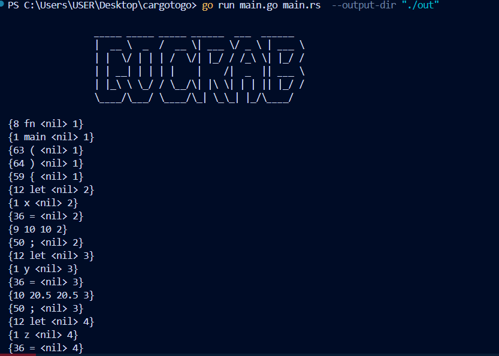

# GoCrab

**GoCrab** is a Rust-to-Go transpiler written in Go. Why? Its my attempt to learn about compilers/transpilers, who knows I may love it?


> This image alone is enough to make this project sound sooooo much cooler.

```
Writing a complete back end for a language can be a lot of work. If you have some existing generic IR to target, you could bolt your front end onto that. Otherwise, it seems like you’re stuck. But what if you treated some other source language as if it were an intermediate representation?

You write a front end for your language. Then, in the back end, instead of doing all the work to lower the semantics to some primitive target language, you produce a string of valid source code for some other language that’s about as high level as yours. Then, you use the existing compilation tools for that language as your escape route off the mountain and down to something you can execute.

The front end—scanner and parser—of a transpiler looks like other compilers. Then, if the source language is only a simple syntactic skin over the target language, it may skip analysis entirely and go straight to outputting the analogous syntax in the destination language.

If the two languages are more semantically different, you’ll see more of the typical phases of a full compiler including analysis and possibly even optimization. Then, when it comes to code generation, instead of outputting some binary language like machine code, you produce a string of grammatically correct source (well, destination) code in the target language.

Either way, you then run that resulting code through the output language’s existing compilation pipeline, and you’re good to go.
```
### Frontend Of the transpiler

#### Step 1 : Lexical Analysis
```
A scanner (or lexer) takes in the linear stream of characters and chunks them together into a series of something more akin to “words”. In programming languages, each of these words is called a token. 
```

Here in our lexer package, we have a loop that runs through the entire code and tokenizes the code based on whether it is an identifier, a keyword, a string, a number etc.

The output for the following rust code :
```rust
fn main() {
    let x = 10;
    let y = 20.5;
    let z = x + y - 3 * (5 / 2) % 2;
    let a = !x && y || z;
    let c = x > y && y <= z || x == 10;
    let result = if x != y { "unequal" } else { "equal" };
    let complex = (x << 2) + (y >> 1) - (a ^ c);
}
```
is 


Very Cool!

#### Step 2 : Parsing


#### Step 3 : Static Analysis


### Middleware Of the transpiler

#### Step 4 : Intermediate Representation

This is where we use LLVMIR or MLIR? IDk?
##### Words of a wise man that alas i do not know the meaning of: 
I’d probably do an AST dump and then just do 1:1 substitutions for the language constructs wherever possible 
You can pick version 1 of the language and ignore everything outside the core language
I dont think you need to reach the llvm ir at all. LLVM IR is very low level (close to assembly), so you will lose information about loops and other programming constructs, so if you attempt to “unparse” backwards from LLVMIR to source, your go code will end up looking very different from the rust source you began with.
It would be better to just transform one AST to the other AST and then “walk” the AST to get the final transpiled source. ASTs have far more source information so you will end up with something closer to the source rust program
Only trouble might be that I don’t know what kind of AST rust compilers produce, and how easy it is to manipulate
Some compilers have immutable ASTs
I think llvm has a rust and go frontend so maybe those two would work?


## Expected Features

- Translates core Rust syntax to Go equivalents
- Handles basic data structures, functions, and modules
- Converts Rust's memory safety features to idiomatic Go patterns
- Provides CLI for easy file and directory transpilation

## Roadmap

- [ ] Build the transpiler (to be elaborated)
- [ ] Write Proper tests
- [ ] Add Golint
- [ ] Add one click install (via docker maybe?)
- [ ] Have CI/CD for automated releases
- [ ] Build a frontend to showcase the compiler
- [ ] Write Blog

## Getting Started

### Prerequisites

- Go 1.20 or higher

### Installation

To install GoCrab, run the following command:

```sh
go install github.com/skysingh04/GoCrab@latest
```

### Usage

After installing, you can start using **GoCrab** to transpile Rust code files to Go:

```sh
GoCrab path/to/rust/file.rs
```

This command will generate a `.go` file with equivalent Go code in the same directory.


## Contributing

Contributions are welcome! Please read the [CONTRIBUTING.md](CONTRIBUTING.md) file for more details on how to get involved.

## License

This project is licensed under the MIT License. See the [LICENSE](LICENSE) file for details.
